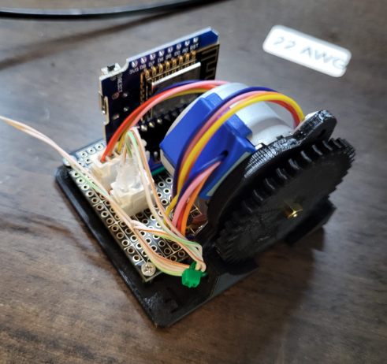
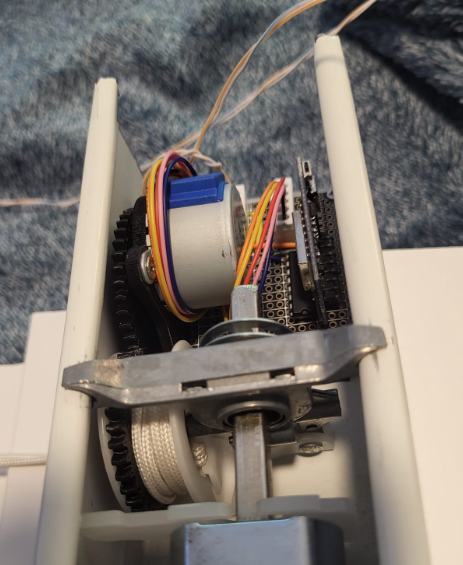
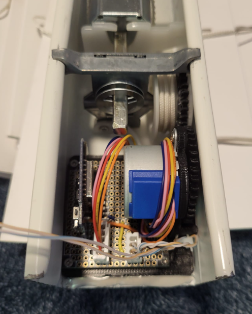

# Automated-Window-Blinds
Window blinds controlled over the cloud

[CAD Files](https://cad.onshape.com/documents/a6c06eb241c09c8feb21c497/w/6788825bff947651f59a3d86/e/f01a4c1e6d0f6e358718e8e2?renderMode=0&uiState=657a3d49c3782d42471a5744) available on Onshape.

<video src="videos/animation.mp4" width=300/>

Demo 

<video src="videos/demo.mp4" height=300/>

This is a test